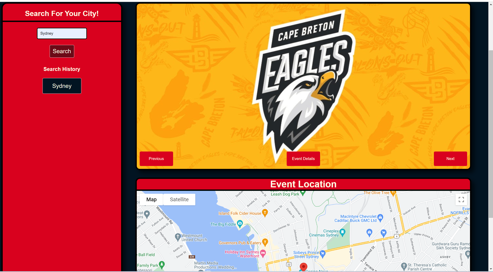

# Carnival Monkey

## Description

Our team project, Carnival Monkey was designed to solve the problem of uncertainty and repetitiveness whilst planning your night out. Simply enter your city into the search bar and let us do the work by reccomending local events ranging from comedy shows to concerts. We wanted to make this project in order to gain experience in producing a project as a team which was probably also the hardest part of this project as before this we were all solo developers so delegating tasks and working without bumping into one another was an obstacle we had to navigate. We used the google maps API and the ticketmaster API to bring this vision to fuition

## Installation
No installation needed. Simply visit our deployed application using this link! https://lwse13.github.io/Carnival-Monkey/
## Usage
Upon visiting our site you will be greeted by our homepage. Simply enter your city and watch as a random event is displayed as well as surrounding attractions which are displayed on the live map underneath. Use the carousel to move through events if the one shown doesn't sound like your cup of tea. Click on the event details button to visit a page with further details of your chosen event which contains a link to the ticketmaster page where you can purchase tickets

## Credits
@SiobahnWarrington: https://github.com/SiobahnWarrington

@Ali-mo12002: https://github.com/Ali-mo12002
## License
N/A
